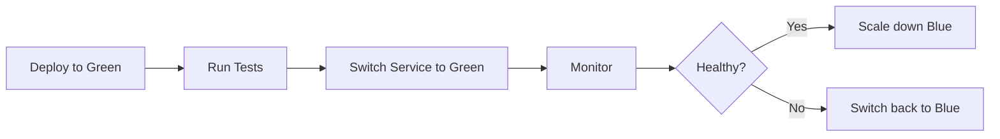

# Phase 25 — Production Deployment

## Implementation Status

All steps from Phase 25 have been implemented.

---

## STEP 25.1 — Staging Environment

**Files:** `infrastructure/kubernetes/staging/`

### Staging Configuration

| Component | Production | Staging |
|-----------|------------|---------|
| Namespace | launchpad | launchpad-staging |
| Database | launchpad | launchpad-staging |
| Redis | production | staging |
| Engage Clouds | Production credentials | Sandbox credentials |
| Domain | api.launchpad.com | staging-api.launchpad.com |

### Staging Resources
- 2 replicas (vs 3-10 in production)
- Smaller resource limits
- Sandbox API keys
- Reduced rate limits

### Staging Features
- Full feature parity with production
- Test data isolation
- Sandbox integrations
- Debug logging enabled

### Promotion to Production
1. Run tests on staging
2. Verify all integrations
3. Get approval
4. Deploy to production canary
5. Monitor metrics
6. Full rollout

---

## STEP 25.2 — Blue-Green Deployments

**File:** `infrastructure/kubernetes/services/blue-green.yaml`

### Strategy
Two identical environments (blue and green) with instant switching.

### Components
- Blue Deployment: Current version (active)
- Green Deployment: New version (standby)
- Service: Switches between blue and green

### Deployment Flow


### Commands
```bash
# Deploy new version to green
kubectl set image deployment/backend-api-green backend-api=launchpad/backend-api:v2.0.0

# Scale up green
kubectl scale deployment/backend-api-green --replicas=3

# Run health checks
kubectl exec -it test-pod -- curl http://backend-api-green:8000/health

# Switch traffic to green
kubectl patch service backend-api -p '{"spec":{"selector":{"version":"green"}}}

# Scale down blue
kubectl scale deployment/backend-api-blue --replicas=0
```

### Rollback
```bash
# Switch back to blue
kubectl patch service backend-api -p '{"spec":{"selector":{"version":"blue"}}}

# Scale up blue
kubectl scale deployment/backend-api-blue --replicas=3

# Scale down green
kubectl scale deployment/backend-api-green --replicas=0
```

---

## STEP 25.3 — Canary Releases

**File:** `infrastructure/kubernetes/services/canary.yaml`

### Strategy
Gradual rollout with traffic splitting.

### Traffic Distribution
| Stage | Stable | Canary | Duration |
|-------|--------|--------|----------|
| Initial | 90% | 10% | 1 hour |
| Stage 2 | 80% | 20% | 2 hours |
| Stage 3 | 50% | 50% | 4 hours |
| Full | 0% | 100% | — |

### Monitoring During Canary
- Error rate comparison
- Latency comparison
- Business metrics comparison
- User feedback

### Promotion Criteria
- Error rate < 1%
- P95 latency < 500ms
- No critical alerts
- Business metrics stable

### Commands
```bash
# Deploy canary
kubectl apply -f infrastructure/kubernetes/services/canary.yaml

# Update canary weight (10% → 20%)
kubectl annotate ingress backend-api-canary nginx.ingress.kubernetes.io/canary-weight="20" --overwrite

# Promote canary to stable
kubectl set image deployment/backend-api-stable backend-api=launchpad/backend-api:v2.0.0
kubectl scale deployment/backend-api-canary --replicas=0

# Rollback canary
kubectl scale deployment/backend-api-canary --replicas=0
kubectl delete ingress backend-api-canary
```

---

## STEP 25.4 — Backup Strategy

**File:** `infrastructure/monitoring/disaster-recovery/backup-strategy.md`

### Backup Schedule

| Component | Frequency | Retention | Destination |
|-----------|-----------|-----------|-------------|
| PostgreSQL | Every 6 hours | 30 days | S3 |
| Redis | Every 1 hour | 7 days | S3 |
| ClickHouse | Daily | 30 days | S3 |
| Application | On deploy | Last 10 | ECR |

### Rollback Procedures

#### Database Rollback
```bash
# Restore from backup
pg_restore -h $DB_HOST -U postgres -d launchpad backup.dump
```

#### Application Rollback
```bash
# Rollback deployment
kubectl rollout undo deployment/backend-api -n launchpad

# Rollback to specific version
kubectl rollout undo deployment/backend-api -n launchpad --to-revision=2
```

#### Blue-Green Rollback
```bash
# Switch back to previous version
kubectl patch service backend-api -p '{"spec":{"selector":{"version":"blue"}}}
```

#### Canary Rollback
```bash
# Remove canary
kubectl scale deployment/backend-api-canary --replicas=0
kubectl delete ingress backend-api-canary
```

### RTO/RPO Targets

| Component | RTO | RPO |
|-----------|-----|-----|
| Database | 1 hour | 6 hours |
| Redis | 15 minutes | 1 hour |
| Application | 30 minutes | N/A |
| File Storage | 1 hour | 1 hour |

---

## Deployment Checklist

### Pre-Deployment
- [ ] All tests passing
- [ ] Security scan clean
- [ ] Performance benchmarks met
- [ ] Documentation updated
- [ ] Change log updated

### Deployment
- [ ] Deploy to staging
- [ ] Run smoke tests
- [ ] Deploy to production canary
- [ ] Monitor for 1 hour
- [ ] Gradual traffic increase
- [ ] Full rollout

### Post-Deployment
- [ ] Verify all features
- [ ] Monitor error rates
- [ ] Check performance metrics
- [ ] Update status page
- [ ] Notify stakeholders
